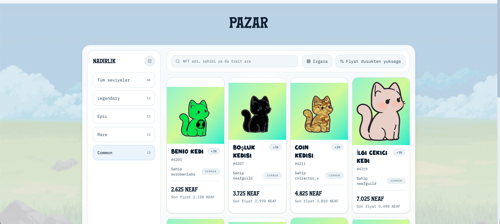
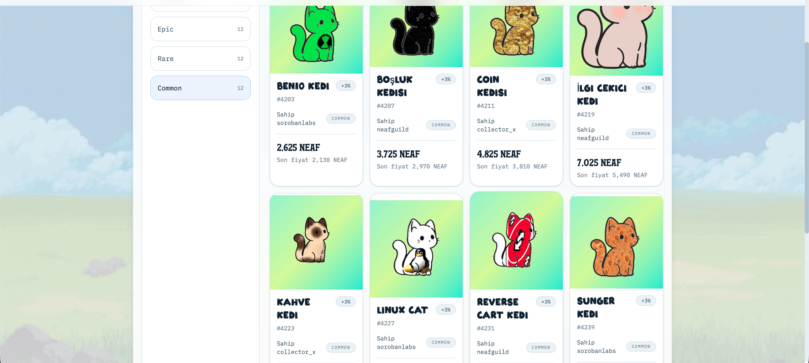
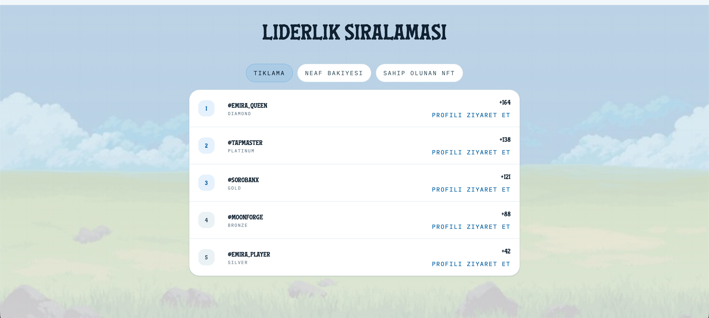

# Emira Core

Emira Core is a Telegram-ready clicker game prototype built for the Stellar / Soroban hackathon track. It combines a React frontend, a lightweight Node.js backend, Telegram Mini App support, WalletConnect and Freighter wallet flows, and real Soroban testnet contract deployment artifacts for rewards and marketplace state.

## Problem

Most clicker and casual reward games are fast, but they usually fail in one of two ways:

- every important action stays fully off-chain, so ownership and rewards are weak
- or every action is pushed on-chain, which makes the game slow, expensive, and unrealistic

For a Telegram-first game, that tradeoff gets worse. Users expect instant gameplay, but hackathon judges expect real blockchain usage.

## Solution

Emira Core uses a hybrid architecture:

1. High-frequency gameplay stays off-chain.
2. Telegram is used as the daily entry surface.
3. WalletConnect and Freighter handle wallet-based actions.
4. Soroban stores durable reward and marketplace state.
5. Stellar testnet transactions provide verifiable blockchain proof.

This gives the game responsive UX without pretending blockchain should store every tap.

## Live Demo

Frontend:
[https://emira-neaf.vercel.app](https://emira-neaf.vercel.app)

Backend health:
[https://emira-neaf.vercel.app/_/backend/health](https://emira-neaf.vercel.app/_/backend/health)

Telegram Mini App launch:
[https://t.me/emira_game_bot?startapp=emira-core](https://t.me/emira_game_bot?startapp=emira-core)

GitHub:
[https://github.com/Sopwit/emira-core](https://github.com/Sopwit/emira-core)

Marketplace contract:
`CBRKJVWTTF5DO2ZVIDOP3TSBTPYQXHGQIPA4ANFI7WKG4X65Y3MCCXJI`

Rewards contract:
`CCO434MY5ASOQIJALSN2KINXVEQMJKCW3HRMVRZSF2MOXUI7O3V4WTJD`

Marketplace contract explorer:
[https://stellar.expert/explorer/testnet/contract/CBRKJVWTTF5DO2ZVIDOP3TSBTPYQXHGQIPA4ANFI7WKG4X65Y3MCCXJI](https://stellar.expert/explorer/testnet/contract/CBRKJVWTTF5DO2ZVIDOP3TSBTPYQXHGQIPA4ANFI7WKG4X65Y3MCCXJI)

Rewards contract explorer:
[https://stellar.expert/explorer/testnet/contract/CCO434MY5ASOQIJALSN2KINXVEQMJKCW3HRMVRZSF2MOXUI7O3V4WTJD](https://stellar.expert/explorer/testnet/contract/CCO434MY5ASOQIJALSN2KINXVEQMJKCW3HRMVRZSF2MOXUI7O3V4WTJD)

Marketplace deploy transaction:
`a025b5e75ba66744f197912a8f1e0d83cee7f9d3d33fe92375f9a73b531ca28c`

Rewards deploy transaction:
`a3a33e1004ef366c0240b7c3e782c9d2fe5c620558225ef8fd42822c353d8d51`

All recorded transaction hashes:
[docs/submission/transaction-hash.md](docs/submission/transaction-hash.md)

## Screenshots

### Profile


### Market Grid



### Market Detail



### Leaderboard



## Hackathon Submission Requirements

This repository includes the requested submission artifacts:

- 🇬🇧 English `README.md`
- 🔗 Transaction hash proof: [docs/submission/transaction-hash.md](docs/submission/transaction-hash.md)
- 🖼️ Project screenshots under [docs/screenshots](docs/screenshots)

## Production Architecture

- **Frontend** is deployed on Vercel.
- **Backend API** runs through the same Vercel deployment via rewrites to `api/index.mjs`.
- **Telegram Mini App** opens the production frontend URL.
- **Wallet actions** use WalletConnect in Telegram/mobile and Freighter on desktop.
- **Soroban contracts** represent durable reward and marketplace logic on Stellar testnet.
- **Persistence** supports PostgreSQL, with local file fallback for development.

```text
Telegram / Web User
  |
  v
Vercel Frontend
  |
  v
Vercel API Runtime
  |
  +--> Telegram session validation
  +--> Profile / leaderboard / market APIs
  +--> Wallet link and prepared chain actions
  |
  v
Stellar Testnet / Soroban
```

## Production URLs

| Service | URL / Identifier |
|---|---|
| Frontend | https://emira-neaf.vercel.app |
| Backend Base | https://emira-neaf.vercel.app/_/backend |
| Backend Health | https://emira-neaf.vercel.app/_/backend/health |
| Telegram Bot | `@emira_game_bot` |
| Telegram Launch | https://t.me/emira_game_bot?startapp=emira-core |
| Telegram Webhook | https://emira-neaf.vercel.app/_/backend/api/v1/telegram/webhook |
| GitHub Repository | https://github.com/Sopwit/emira-core |
| Marketplace Contract | CBRKJVWTTF5DO2ZVIDOP3TSBTPYQXHGQIPA4ANFI7WKG4X65Y3MCCXJI |
| Rewards Contract | CCO434MY5ASOQIJALSN2KINXVEQMJKCW3HRMVRZSF2MOXUI7O3V4WTJD |
| Marketplace Deploy Tx | a025b5e75ba66744f197912a8f1e0d83cee7f9d3d33fe92375f9a73b531ca28c |
| Marketplace Init Tx | 9059e4423aa6c9bd7d379a1736dbf5015cb84091aeb02c0c0568e05d7a587df5 |
| Rewards Deploy Tx | a3a33e1004ef366c0240b7c3e782c9d2fe5c620558225ef8fd42822c353d8d51 |
| Rewards Init Tx | 2a62f4aabc67eb25a4d44bec9e286d9bdab15291a561048707b34de7e7a5095f |

## Key Features

- Telegram Mini App compatible gameplay
- Clicker progression with upgrades and NFT drops
- Profile, museum, market, and leaderboard surfaces
- WalletConnect support for Telegram and mobile
- Freighter support for desktop wallet actions
- Soroban marketplace contract scaffold with listing lifecycle
- Soroban rewards contract scaffold with reward pool and claim accounting
- Recorded Stellar testnet transaction hashes
- Vercel deployment ready frontend and backend integration

## How It Works

1. User opens Emira from web or Telegram.
2. Telegram session is validated when inside the Mini App.
3. User starts tapping and progressing off-chain.
4. Backend serves profile, leaderboard, and market read models.
5. User connects a Stellar wallet when a durable action is needed.
6. WalletConnect is used inside Telegram/mobile, Freighter on desktop.
7. Reward and marketplace actions are represented by Soroban contract logic.
8. Testnet deployment and init transactions provide blockchain proof for the hackathon.

## Why This Is A Real Blockchain Fit

This is not a generic Web2 game with a token sticker on top.

- Taps, combo, and moment-to-moment gameplay stay off-chain because they are high-frequency.
- Reward claim accounting belongs on-chain because it needs durable, trust-sensitive state.
- Marketplace listing state belongs on-chain because ownership changes and sale state must be verifiable.
- Telegram gives distribution and retention, while Soroban gives credibility and durable state.

That split is exactly why this project fits a blockchain hackathon.

## Soroban Contracts

The repository contains real contract code:

- [contracts/emira_marketplace/src/lib.rs](contracts/emira_marketplace/src/lib.rs)
- [contracts/emira_rewards/src/lib.rs](contracts/emira_rewards/src/lib.rs)

What they currently cover:

- `emira_marketplace`
  - contract initialization
  - create listing
  - update listing price
  - cancel listing
  - mark listing as sold

- `emira_rewards`
  - reward pool initialization
  - fund reward pool
  - set max claim amount
  - record player progress snapshot
  - claim reward accounting

These are real Soroban contracts with local tests and documented testnet deployment artifacts.

## Testnet Proof

Verified hashes are recorded here:
[docs/submission/transaction-hash.md](docs/submission/transaction-hash.md)

Highlights:

- Marketplace upload: `07f4f26164870b4110deee7001eee0faaa4b8f5bd8c20fc350fb16674aa28a36`
- Marketplace deploy: `a025b5e75ba66744f197912a8f1e0d83cee7f9d3d33fe92375f9a73b531ca28c`
- Marketplace init: `9059e4423aa6c9bd7d379a1736dbf5015cb84091aeb02c0c0568e05d7a587df5`
- Rewards upload: `b25f7fbcffcc9b381e80578abf2b5334531b977532633a24f2ef40cd79c97b32`
- Rewards deploy: `a3a33e1004ef366c0240b7c3e782c9d2fe5c620558225ef8fd42822c353d8d51`
- Rewards init: `2a62f4aabc67eb25a4d44bec9e286d9bdab15291a561048707b34de7e7a5095f`

## Tech Stack

Frontend:

- React 19
- Vite
- TypeScript
- Tailwind CSS 4
- Framer Motion

Backend:

- Node.js
- Vercel serverless entry
- Telegram auth/session flow
- Profile, leaderboard, progress, and market APIs

Blockchain:

- Stellar SDK
- Stellar Testnet
- Soroban smart contracts
- Freighter
- WalletConnect

## Project Structure

```text
backend/
contracts/
docs/
  screenshots/
  submission/
frontend/
README.md
vercel.json
```

## Environment Variables

Public repo rule:

- only commit `*.example` files
- never commit `.vercel/` project linkage files
- keep real secrets only in local ignored env files or hosting provider secret storage
- never put backend secrets in `VITE_*` variables because those are public in the browser
- run `npm run ci` before opening a public PR or pushing to the main branch

### Frontend / Vercel

```env
VITE_API_BASE_URL=/_/backend
VITE_WALLETCONNECT_PROJECT_ID=example-walletconnect-project-id
VITE_TELEGRAM_WEBAPP_URL=https://emira-neaf.vercel.app
VITE_TELEGRAM_BOT_USERNAME=emira_game_bot
VITE_TELEGRAM_STARTAPP=emira-core
VITE_STELLAR_NETWORK=testnet
VITE_SOROBAN_RPC_URL=https://soroban-testnet.stellar.org
VITE_STELLAR_HORIZON_URL=https://horizon-testnet.stellar.org
VITE_SOROBAN_MARKET_CONTRACT_ID=CBRKJVWTTF5DO2ZVIDOP3TSBTPYQXHGQIPA4ANFI7WKG4X65Y3MCCXJI
VITE_SOROBAN_REWARDS_CONTRACT_ID=CCO434MY5ASOQIJALSN2KINXVEQMJKCW3HRMVRZSF2MOXUI7O3V4WTJD
```

### Backend / Vercel

```env
TELEGRAM_BOT_TOKEN=example-set-in-hosting-secret-store
TELEGRAM_WEBHOOK_SECRET=example-set-a-long-random-secret
TELEGRAM_BOT_USERNAME=emira_game_bot
TELEGRAM_WEBAPP_URL=https://emira-neaf.vercel.app
TELEGRAM_STARTAPP=emira-core
SESSION_JWT_SECRET=example-generate-a-long-random-secret
WALLETCONNECT_PROJECT_ID=example-walletconnect-project-id
STELLAR_NETWORK=testnet
SOROBAN_RPC_URL=https://soroban-testnet.stellar.org
STELLAR_HORIZON_URL=https://horizon-testnet.stellar.org
STELLAR_MARKETPLACE_ADDRESS=GCZGKZXINPUV6PMBHWOGKX4B2LAB4PUUOFSV4KJ765C6ZQXZNRDDF6SB
SOROBAN_MARKET_CONTRACT_ID=CBRKJVWTTF5DO2ZVIDOP3TSBTPYQXHGQIPA4ANFI7WKG4X65Y3MCCXJI
SOROBAN_REWARDS_CONTRACT_ID=CCO434MY5ASOQIJALSN2KINXVEQMJKCW3HRMVRZSF2MOXUI7O3V4WTJD
POSTGRES_URL=your_postgres_url_if_used
ALLOW_TELEGRAM_MOCK=false
```

## Deployment Steps

### Vercel

1. Import the GitHub repository.
2. Keep the project root at repository root.
3. Use the provided `vercel.json`.
4. Add frontend and backend environment variables.
5. Confirm the public alias resolves to `https://emira-neaf.vercel.app`.
6. Run `npm run audit:public` before pushing a public commit.
6. Redeploy after every environment change.

### Telegram Mini App

1. Set the Mini App URL in BotFather to `https://emira-neaf.vercel.app`.
2. Set the menu button to the same public URL.
3. Set the webhook URL to `https://emira-neaf.vercel.app/_/backend/api/v1/telegram/webhook`.
4. Use webhook secret header validation with `TELEGRAM_WEBHOOK_SECRET`.
5. Test launch flow from `https://t.me/emira_game_bot?startapp=emira-core`.

### Soroban Testnet

1. Build contracts.
2. Deploy to Stellar testnet.
3. Record deploy and init hashes.
4. Add contract IDs and hashes into the submission docs.

## Deployment Troubleshooting

Common issues:

- Vercel env changes require redeploy.
- The retired `https://emira-core.vercel.app` alias is no longer valid as of 2026-05-05 and returns `DEPLOYMENT_NOT_FOUND`.
- Telegram popup blank screen can happen if a broken JS bundle is cached.
- WalletConnect requires a valid `VITE_WALLETCONNECT_PROJECT_ID`.
- Telegram auth requires correct bot token and public web app URL.
- PostgreSQL is optional for local demos, but persistent environments should use it.

## Demo Flow

1. Open [https://emira-neaf.vercel.app](https://emira-neaf.vercel.app)
2. Open the same experience from Telegram Mini App.
3. Show tap gameplay and upgrades.
4. Show NFT collection and market screens.
5. Show wallet connection via Freighter or WalletConnect.
6. Show the recorded Soroban contract IDs and testnet transaction hashes.
7. Explain that gameplay is fast off-chain while meaningful state is represented on Soroban.

## Current MVP Limitations

- Testnet only
- Reward and marketplace logic are still MVP-oriented
- Backend persistence may fall back to file storage if Postgres is not configured
- Telegram experience is functional but still needs mobile polish in some areas
- Contracts should be extended and audited before any production-grade use

## Future Work

- Complete prepared buy/list/cancel transaction builder flow
- Add stronger market settlement reconciliation
- Improve Telegram-native mobile layout polish
- Add season snapshot and claim pipeline
- Add production-grade database and event indexing
- Expand NFT ownership sync between backend and chain events

## One-line Pitch

Emira Core turns a Telegram clicker game into a credible Stellar / Soroban hackathon project by keeping gameplay instant off-chain while moving durable reward and marketplace state onto Soroban.
